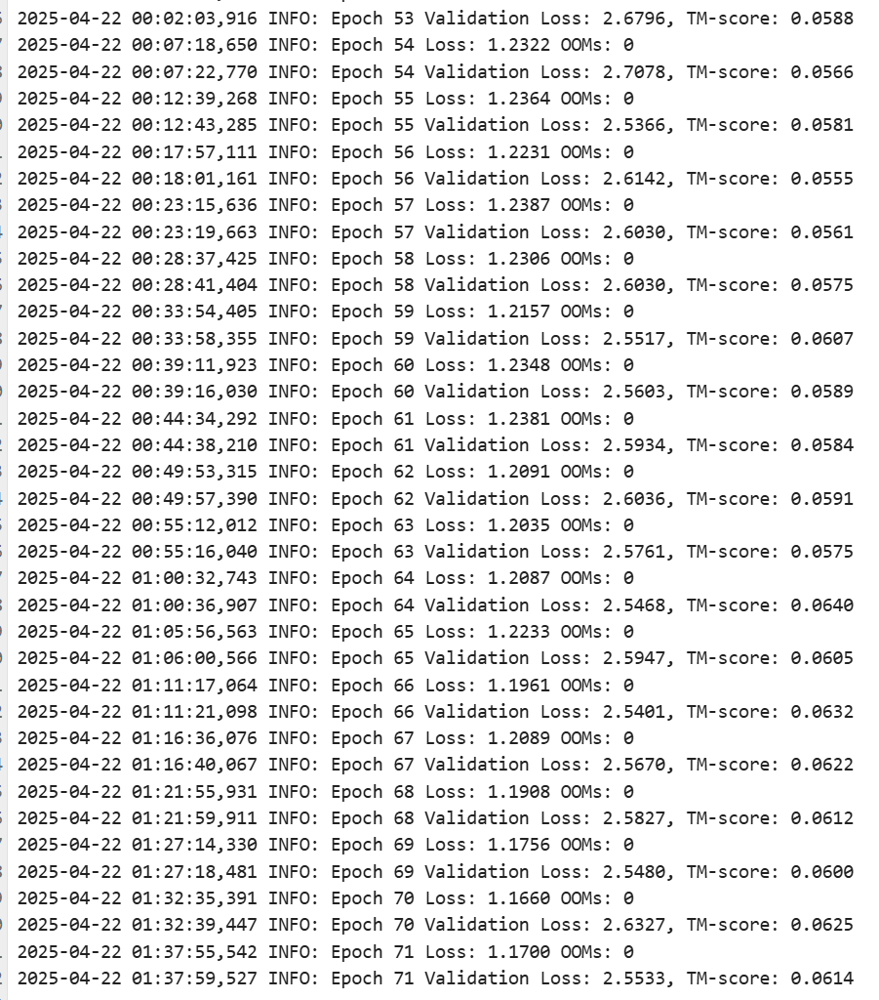

# 🚀 RibonanzaMamba: 用Mamba魔改RNA折叠预测模型啦～  

## 🌱 项目简介  
Yoyoyo～这里是菜鸡学生第一次硬刚模型优化！在研究PointNet的时候接触到了Mamba,最近发现Mamba这玩意儿居然不只卷NLP,CV，在RNA折叠预测这种序列到结构的任务里也能插一脚？！于是果断对本次比赛的RibonanzaModel下了手，魔改出了RibonanzaMamba！  

作为一个平时很少有机会摸到前沿技术的菜鸡，目前能力肯定还很拉胯，优化效果大概率打不过顶流大佬😭 但作为第一次练手+开眼界的小项目，还是会狠狠努力的！主打一个重在参与，边踩坑边成长～  

## 🧬 项目亮点（给自己画饼版）  
- **Mamba乱入RNA领域**：谁说Mamba只能卷NLP,图像？偏要试试在RNA折叠预测里搞事情，看看这个序列模型能不能盘活结构预测～  
- **魔改初体验**：从RibonanzaModel到RibonanzaMamba，记录第一次给模型动“手术”的全过程——改架构、调参数、疯狂debug（以及被GPU算力暴打）,我服了特别是用了梯度检查点(以计算时间换减少显存使用)，第一次接触这玩意儿给我上了一个晚上的强度，好在有gpt老师陪着我通宵，一晚上把gradient_check这玩意整完啦
- **菜鸡成长日记**：没有大佬级优化效果，但用来记录我的进步～  

## 🎯 主要目标（不摆烂版）  
1. **🤖 使用Mamba**：直接暴力做法，在原本的Transformer+CNN的基础上，改进CNN->可分离卷积(轻量化),然后Mamba+CNN直接在原本基础上，增加精准度，拿复杂度换准确度(对的就是暴力)
2. **📈 提升预测精度**：让魔改后的模型比“前任”RibonanzaModel更懂RNA折叠（哪怕只提升1%！）  
3. **📚 攒实战经验**：复现大佬的源码，搞懂“优化模型”到底是在优化啥，自己写一个优化架构并融合  

## 🔜 未来计划（画饼但会努力版）  
- **💻 代码开源**：等摸清楚代码逻辑（不保证能跑），会把魔改过程整理出来，欢迎大佬拍砖！  
- **📊 效果对比**：和原版模型battle一下，用数据说话（如果没被吊打太惨的话）  
- **👥 求带飞**：超级欢迎同领域的小伙伴来唠嗑！
  

## ✨ 最后叨叨  
虽然现在还是个菜鸡，但相信慢慢折腾总能搞出点东西！项目可能很粗糙，代码可能很阴间，但每一步都是认真踩的坑～ 欢迎围观菜鸡进化史！  

（PS：如果有大佬路过觉得哪里能优化，求轻喷但更求指点！😭🙏）  

  
 
## 日志
2025/4/4 - 复现完代码，提出mamba计算复杂度换精度方案   
2025/4/5 - 初步完成代码框架，添加mambablock,改造cnn->separableCNN   
2025/4/10 - emo了，kaggle的后端有问题，scoring error   
2025/4/17 - GPU显存炸缸啦，添加梯度检查点，计算时间换gpu显存 ->结果跑的巨慢   
2025/4/18 - 练到 Epoch 27 崩溃，Dropout 反向传播出 NaN，貌似是Attention 输出中包含了 NaN，进而影响 Dropout，再进一步反向时传播为 NaN   
2025/4/20 - 我服了忘了Jupyter是基于 Web 的交互式环境,在服务器上跑的时候，当成终端直接关了,回来一看天塌了QAQ  
2025/4/21 - 70个epoch后效果还行，附上run.log，不知道未来效果咋样，但是attn那里还是出现了nan，我之前没有完全修改正确

2025/4/22 - 因为使用了混合精度,第124个epoch(TM-score来到0.079)出现报错:NativeDropoutBackward0 returned nan values,取消混合精度。

# Yoyoyo~
## This is my first try for Optimizing a base model , after doing the research in the pointnet area , I found that the Mamba not only sufficiently applied for cv's task,but also it fit the sequence2structure task like RNA Folding Prediction! So I try me best to optimize the base model - RibonanzaModel  to RibonanzaMamba
## As a S1mple student , I rarely have the opportunity to spare time to contact with the deepest technology, and my ability is not up to the standard for now time, so the optimization effect is certainly not as good as the top leader.But as it is the first game for me to practice my skills and broaden my horizon,I'll try my best to work for this
